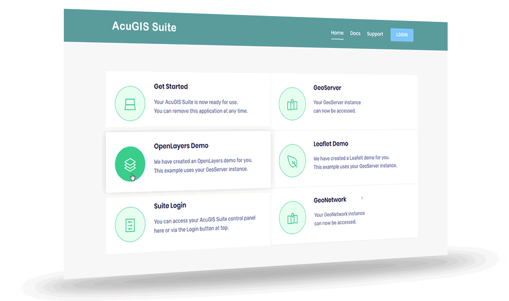

AcuGIS Suite
==================================================

.. include:: ../README.rst

.. toctree::
   :caption: Getting Started
   :maxdepth: 2

   intro
   webmin
   
.. toctree::
    :maxdepth: 3
    :caption: Components

    components/general/index
    components/tomcat/index
    components/postgresql/index
    components/postgis/index
    components/pgrouting/index
    components/geoserver/index
    components/shp2pgsql/index
	components/proxy/index
	
.. toctree::
    :maxdepth: 3
    :caption: PostgreSQL

    postgresql/snapshot/index
    postgresql/clone/index
    postgresql/restore/index    
	
	
.. toctree::
    :maxdepth: 3
    :caption: Mapping Tools
	
	maptools/intro/index
    maptools/mapstore2/index
    maptools/lizmap/index
    maptools/mapbender/index
    maptools/other/index
	

.. toctree::
    :maxdepth: 3
    :caption: Satellite

    satellite/intro/index
    

    
.. toctree::
    :maxdepth: 2
    :caption: Web Apps

    webapps/homepage
    webapps/openlayers
    webapps/leafletjs

.. toctree::
    :maxdepth: 2
    :caption: Resources

    resources/css
    resources/security
    resources/support
    
    
    
    

