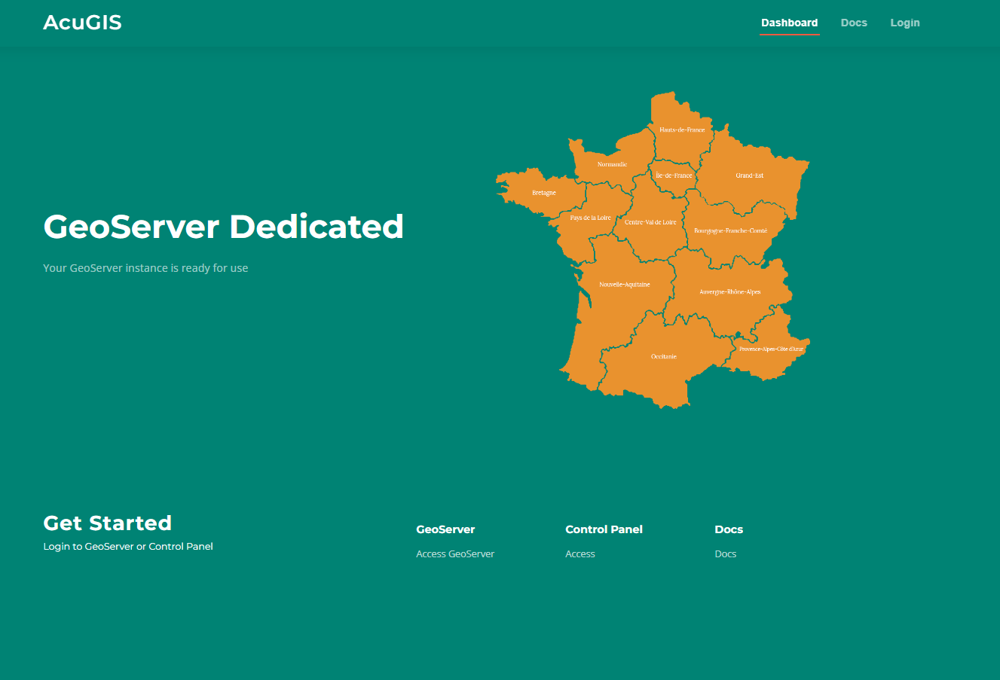

Intro
===========================

Overview
------------

AcuGIS GeoServer Dedicated Hosting allows you to manage all aspects of your Open Source GIS stack quickly and easily.

All installed components are non-forked and un-modified and installed via the projects archive.

System Requirements
-------------------
* Ubuntu 22 or 24
* Rocky Linux 8 or 9
* Oracle Enterprise Linux

Authors
-------
* `David Ghedini`_

.. _`David Ghedini`: https://github.com/DavidGhedini

Components
----------

`PostgreSQL`_

.. _`PostgreSQL`: https://www.opal-consulting.de/downloads/free_tools/JasperReportsIntegration/ 

`PostGIS`_

.. _`PostGIS`: https://community.jaspersoft.com/project/jasperreports-library 

`Apache Tomcat`_

.. _`Apache Tomcat`: http://tomcat.apache.org/ 

`OpenJDK`_

.. _`OpenJDK`: https://openjdk.java.net/

`GeoServer`_

.. _`GeoServer`: https://openjdk.java.net/
 

    

